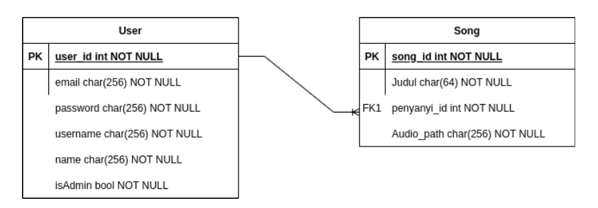

# binotify-rest: The Backend for binotify

## Introduction

binotify-rest adalah backend dari aplikasi binotify (khususnya binotify premium). Aplikasi ini dibuat dengan menggunaan Express + Typescript + PostgreSQL. Aplikasi ini dibuat untuk memenuhi tugas besar mata kuliah Pemrograman Aplikasi Berbasis Web.

## Overview Feature

- Express with Typescript based app
- Auth utilizing JWT
- PostgreSQL as database
- Dockerized
- cached response with Redis
- SOAP calls to binotify-soap
- Static file serving

## Skema basis data

Basis data terdiri atas dua tabel, yaitu tabel users dan tabel songs. Tabel users menyimpan informasi mengenai user, sedangkan tabel songs menyimpan informasi mengenai lagu. Tabel songs memiliki foreign key yang mengacu pada tabel users.

## Daftar endpoint

- POST /api/register
  Digunakan untuk mendaftarkan user baru kepada sistem.
- POST /api/login
  Digunakan untuk masuk ke dalam sistem dan akan memberikan response berupa jwt token
- POST /api/song
  Digunakan untuk menambahkan lagu baru ke dalam sistem. Endpoint ini membutuhkan jwt token yang didapat dari endpoint login.
- GET /api/song/:id
  Digunakan untuk mendapatkan informasi mengenai lagu dengan id tertentu. Endpoint ini membutuhkan jwt token yang didapat dari endpoint login.
- DELETE /api/song/:id
  Digunakan untuk menghapus lagu dengan id tertentu. Endpoint ini membutuhkan jwt token yang didapat dari endpoint login.
- PUT /api/song/:id
  Digunakan untuk mengubah informasi mengenai lagu dengan id tertentu. Endpoint ini membutuhkan jwt token yang didapat dari endpoint login.
- GET /api/artist
  Digunakan untuk mendapatkan list artist.
- GET /api/artist/song/:id
  Digunakan untuk mendapatkan list lagu dari artist tertentu yang sudah disubscribe oleh pengguna Binotify App. Endpoint ini tidak membutuhkan token jwt.
- GET /api/subscription
  DIgunakan untuk mendapatkan list request subscription. Pengguna harus menggunakan jwt token admin.
- PUT /api/subscription/update
  Digunakan untuk mengubah status request subscription. Pengguna harus menggunakan jwt token admin.
- GET /api/username
  Digunakan untuk mengecek apakah username sudah terdaftar atau belum. Digunakan saat validasi register.
- GET /api/songlist/:id
  Digunakan untuk mendapatkan list lagu dari penyanyi tertentu. Endpoint ini membutuhkan endpoint jwt.
- GET /api/name/:id
  Digunakan untuk mendapatkan nama dari penyanyi tertentu.
- GET /api/premium/:id
  Digunakan untuk mendapatkan list lagu premium dari pengguna Binotify App.

Untuk melihat detail dari setiap endpoint, silahkan lihat file `Binotify.postman_collection.json` yang terdapat pada repositori `binotify-config`.

## Cara menjalankan aplikasi

Alternatif 1:

1. Pastikan sudah terinstall NodeJS dan PostgreSQL
2. clone repositori ini
3. Buat file `.env` pada root folder aplikasi mengikuti contoh .env.example
4. Install dependency dengan menjalankan perintah `yarn install`
5. Jalankan aplikasi dalam mode development dengan `yarn dev`
6. Atau, dalam mode production, `yarn start`

Alternatif 2: Docker

1. Lakukan `docker compose up --build`

### Pembagian Tugas

#### Proudly Presented by Binosed, 2022
